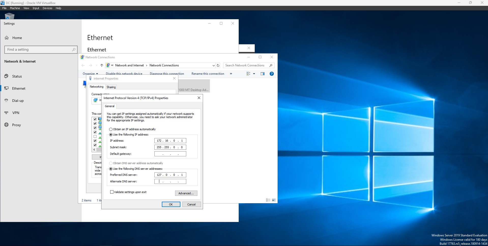
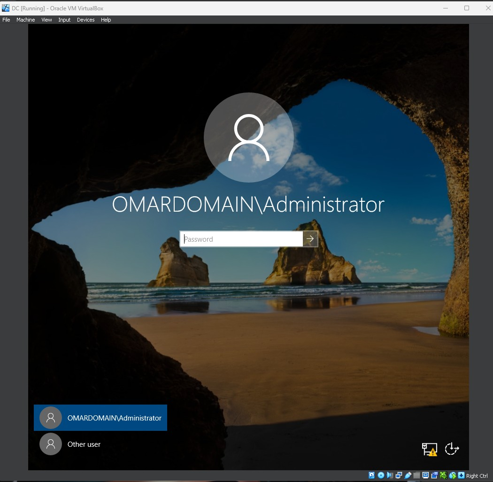
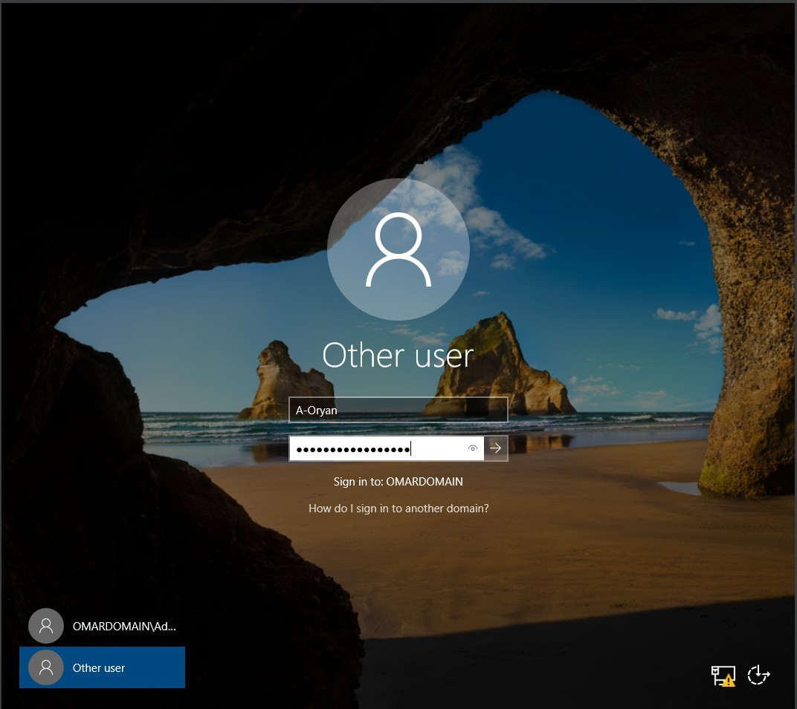
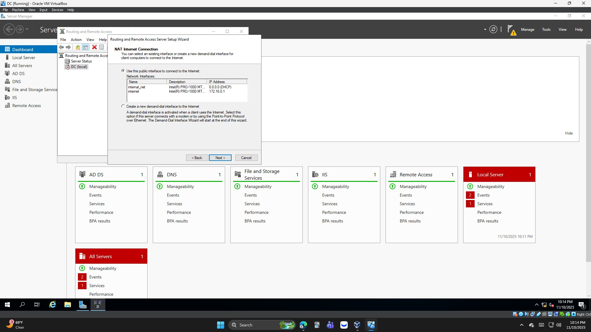
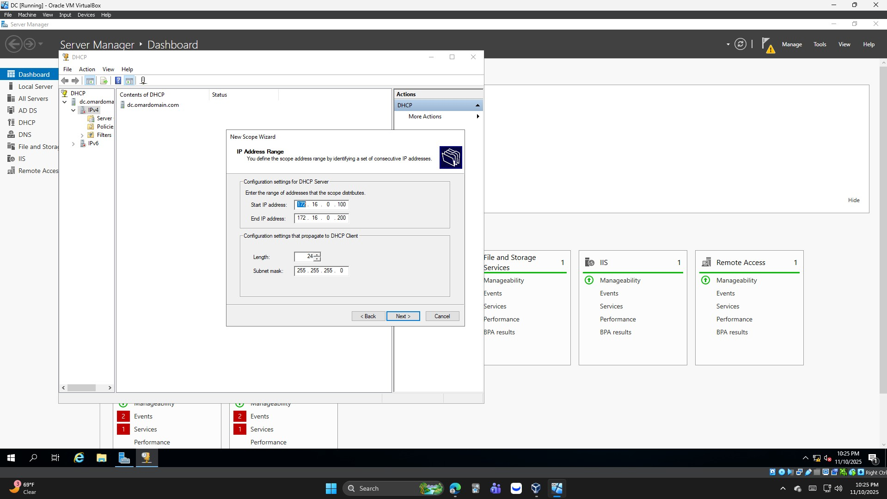
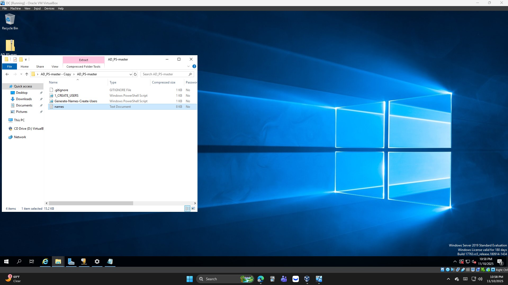
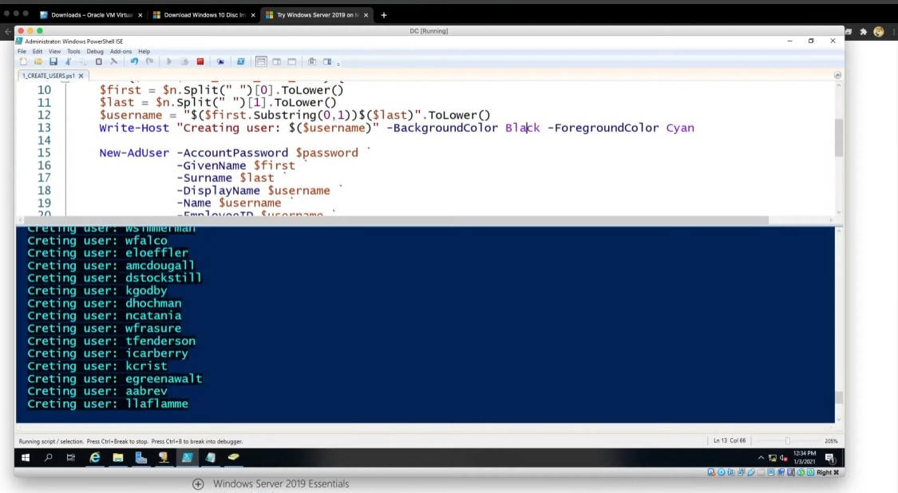
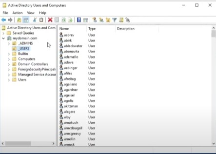

# Home-Lab-Running-Active-Directory (VirtualBox)

This project demonstrates the deployment and configuration of a fully functional **Active Directory environment** on a personal computer using **Oracle VirtualBox**. The lab simulates a small Windows network environment with a **Domain Controller (Server 2019)** and a **Windows 10 client**, covering domain services, DHCP, NAT, and user management automation via PowerShell.

---

## 🔧 Project Overview

This lab was designed to help develop practical experience with **Active Directory**, **Windows Server administration**, and **Windows networking** fundamentals. It replicates a simplified enterprise setup where users can log into multiple systems under one centralized domain.

### Environment Components
- **Virtualization Platform:** Oracle VirtualBox  
- **Operating Systems:**  
  - Windows Server 2019 (Domain Controller)  
  - Windows 10 Pro (Client)
- **Networking Setup:**  
  - Adapter 1: NAT (Internet access)  
  - Adapter 2: Internal Network (Private LAN for domain communication)

---

## 🧩 Configuration Steps

### 1. Virtual Machine Setup 
- Installed **Oracle VirtualBox** and the **Extension Pack**.
- Created one virtual machine:
  - **Domain Controller (DC)** running **Windows Server 2019**.
- Assigned two network adapters to the DC:
  - **NAT** for external internet access.
  - **Internal Network** for private connectivity.
- The **client VM** (Windows) will be created and configured later in the project.

#### 📸 Visual Reference
Below is a screenshot of the **VirtualBox environment** showing the Domain Controller virtual machine prior to startup — serving as a visual reference for the lab setup.

  

> *Screenshot:* The VirtualBox Manager displaying the created Domain Controller VM before being powered on.

### 2. Windows Server 2019 Configuration
- Installed **Server 2019** on the Domain Controller VM.
- Installed **VirtualBox Guest Additions** for better performance and display scaling.
- Configured **static IP addressing**:
  - Internal NIC: `172.16.0.1`
  - Subnet Mask: `255.255.255.0`
  - DNS: `127.0.0.1` (loopback)

#### 📸 Visual Reference
Below is a screenshot of the **network configuration** inside the Domain Controller VM, showing the static IP setup used for the internal network.

  

> *Screenshot:* The Windows Server 2019 network configuration displaying the static IP settings for the internal NIC.

### 3. Active Directory Setup
- Installed the **Active Directory Domain Services (AD DS)** role.
- Created a new forest and domain: `OmarDomain.com`.
- Created a dedicated **Domain Admin account** under an OU named `MyAdmins`.
- Granted the account **Domain Admin** privileges.

#### 📸 Visual Reference
Below is a screenshot taken during the **Active Directory setup process**, showing where the domain name was specified while creating the new forest.

  

> *Screenshot:* The domain naming screen during the Active Directory setup for `OmarDomain.com`.

#### 📸 Visual Reference
Below is a screenshot showing the **successful domain login screen** after the server reboot, confirming that the system is now part of the `OmarDomain.com` domain.

  

> *Screenshot:* The Windows Server 2019 login screen showing `OMARDOMAIN\Administrator` after the domain promotion.

### 4. Organizational Unit and User Creation
After confirming the domain setup was successful, the next step was to organize administrative accounts and create a user within Active Directory.

- Opened **Active Directory Users and Computers (ADUC)** from the Server Manager.
- Created a new **Organizational Unit (OU)** named `ADMINS` to store administrative accounts.
- Within the `ADMINS` OU, created a new user account named **Omar Ryan**.
- Configured the account with a secure password and default logon settings.
- Added the **Omar Ryan** account to the **Domain Admins** security group to grant administrative privileges.
- Verified the user’s entry and group membership within the `ADMINS` OU in ADUC.

#### 📸 Visual Reference
Below is a screenshot showing the **ADMINS Organizational Unit** containing the **Omar Ryan** user account within Active Directory.

  

> *Screenshot:* The Active Directory Users and Computers console displaying the `ADMINS` OU with the `Omar Ryan` user account inside.

---

#### 📸 Login Verification
After creating the account, logged into the server using the new **domain admin credentials** to verify successful authentication.

  

> *Screenshot:* Successful login to the domain as the `A-Oryan` account, confirming administrative access.

### 5. Routing and Remote Access (RRAS) Setup
With the domain and administrative account configured, the next objective was to enable **network routing** between the internal and external networks using **RRAS (Routing and Remote Access Service)**.

- Opened **Server Manager** → **Add Roles and Features**.
- Installed the **Remote Access** role and selected **Routing** under role services.
- After installation, opened the **Routing and Remote Access** console.
- Configured the server for **NAT (Network Address Translation)** routing:
  - Chose the external network adapter connected to the internet (NAT adapter).
  - Selected the internal adapter connected to the private network (`172.16.0.0/24`).
- Enabled **LAN routing** to allow traffic between the client and external network.

#### 📸 Visual Reference
Below is a screenshot showing the **Routing and Remote Access Server Setup Wizard** during configuration.

  

> *Screenshot:* The Routing and Remote Access Server Setup Wizard displaying configuration options for NAT routing.

### 6. DHCP Configuration
After setting up RRAS for network routing, the next step was to configure **DHCP (Dynamic Host Configuration Protocol)** on the Domain Controller to automatically assign IP addresses to devices on the internal network.

- Opened **Server Manager** → **Add Roles and Features**.
- Installed the **DHCP Server** role and completed the post-installation configuration.
- Authorized the DHCP server in **Active Directory** to allow it to issue IP leases.
- Created a new **DHCP scope** with the following settings:
  - **Name:** 172.16.0.100–200
  - **IP Range:** `172.16.0.100` – `172.16.0.200`
  - **Subnet Mask:** `255.255.255.0`
  - **Default Gateway:** `172.16.0.1`
  - **DNS Server:** `172.16.0.1`
- Activated the scope and verified that the DHCP service was running.

#### 📸 Visual Reference
Below is a screenshot showing the **DHCP scope configuration window** where the IP address range was defined.

  

> *Screenshot:* The DHCP configuration window showing the IP range being set to `172.16.0.100–200` for the internal network.

### 7. Bulk User Creation with PowerShell
After configuring the domain, DHCP, and RRAS, the next objective was to automate the creation of multiple Active Directory user accounts using a PowerShell script.

- Utilized a PowerShell automation script originally created by **Josh Madakor**, designed for educational and lab environments.  
- Copied the automation folder onto the **Domain Controller (DC)**.  
- Reviewed the folder contents, which included the PowerShell script and supporting files.  
- Modified the script variables to:  
  - Create **10,000** user accounts.  
  - Set the password to `Password1`.  
  - Add all accounts to the **_EMPLOYEES** Organizational Unit (OU).  
- Opened **PowerShell ISE** as Administrator and executed the script to generate accounts automatically.

#### 📸 Visual References

**Folder containing the PowerShell automation files**

  

> *Screenshot:* The folder on the Domain Controller VM containing the PowerShell automation files downloaded from Josh Madakor’s GitHub repository.

---

**Running the PowerShell script**

  

> *Screenshot:* PowerShell ISE running Josh Madakor’s automation script, actively creating user accounts in bulk within Active Directory.

---

**Active Directory view of generated users**

  

> *Screenshot:* Active Directory Users and Computers console showing the newly created accounts within the `_EMPLOYEES` Organizational Unit.

---

## 🧠 Key Skills Demonstrated
- Active Directory installation and configuration  
- Windows Server administration  
- DHCP and DNS setup  
- Network Address Translation (NAT) with RRAS  
- PowerShell scripting for automation  
- Domain join and authentication troubleshooting  
- Virtual networking and VM management

---

## 🧰 Tools & Technologies
- **Oracle VirtualBox**
- **Windows Server 2019**
- **Windows 10 Pro**
- **Active Directory Domain Services**
- **Routing and Remote Access (RRAS)**
- **DHCP Server**
- **PowerShell**

---

## 📈 Outcomes
By completing this project:
- Gained hands-on experience managing a Windows domain environment.
- Automated Active Directory user creation via PowerShell scripting.
- Built a realistic, scalable home lab environment suitable for practicing enterprise networking and administration concepts.

---

## 📸 Future Enhancements
- Add **Group Policy Objects (GPOs)** for centralized management.
- Configure **File Sharing and Permissions** across domain users.
- Integrate **Windows Server Update Services (WSUS)** or **Sysmon logging** for further enterprise simulation.
- Extend lab with **SIEM integration (Splunk, Sentinel, etc.)** for security monitoring.

---

## 🪪 Author
**Omar — Cybersecurity Analyst | CompTIA CySA+ | Splunk Certified**

---

